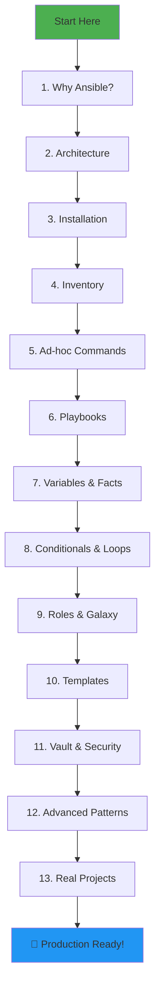

# 🤖 Ansible Complete Learning Guide

> **From "Why does Ansible exist?" to "I can automate entire infrastructure" — A complete journey**

---

## 📚 Table of Contents

| # | Topic | File | Level |
|---|-------|------|-------|
| 1 | [Introduction & Why Ansible](./01-introduction-why-ansible.md) | `01-introduction-why-ansible.md` | 🟢 Beginner |
| 2 | [Architecture & How It Works](./02-architecture-how-it-works.md) | `02-architecture-how-it-works.md` | 🟢 Beginner |
| 3 | [Installation & Setup](./03-installation-setup.md) | `03-installation-setup.md` | 🟢 Beginner |
| 4 | [Inventory Deep Dive](./04-inventory-deep-dive.md) | `04-inventory-deep-dive.md` | 🟡 Intermediate |
| 5 | [Ad-hoc Commands](./05-ad-hoc-commands.md) | `05-ad-hoc-commands.md` | 🟡 Intermediate |
| 6 | [Playbooks — The Core](./06-playbooks-core.md) | `06-playbooks-core.md` | 🟡 Intermediate |
| 7 | [Variables & Facts](./07-variables-facts.md) | `07-variables-facts.md` | 🟡 Intermediate |
| 8 | [Conditionals & Loops](./08-conditionals-loops.md) | `08-conditionals-loops.md` | 🟡 Intermediate |
| 9 | [Roles & Ansible Galaxy](./09-roles-galaxy.md) | `09-roles-galaxy.md` | 🔴 Advanced |
| 10 | [Templates & Jinja2](./10-templates-jinja2.md) | `10-templates-jinja2.md` | 🔴 Advanced |
| 11 | [Vault & Security](./11-vault-security.md) | `11-vault-security.md` | 🔴 Advanced |
| 12 | [Advanced Patterns](./12-advanced-patterns.md) | `12-advanced-patterns.md` | 🔴 Advanced |
| 13 | [Real-World Projects](./13-real-world-projects.md) | `13-real-world-projects.md` | 🟡 Practical |
| 14 | [Cheat Sheet](./14-cheatsheet.md) | `14-cheatsheet.md` | 📋 Reference |

---

## 🎯 What You'll Learn

```
┌─────────────────────────────────────────────────────────────────┐
│                                                                  │
│  Phase 1: Foundation (Ch 1-3)                                    │
│  "Why does Ansible exist and how does it work?"                  │
│  → History, Architecture, Installation                           │
│                                                                  │
│  Phase 2: Core Skills (Ch 4-8)                                   │
│  "How do I actually use Ansible?"                                │
│  → Inventory, Commands, Playbooks, Variables, Logic              │
│                                                                  │
│  Phase 3: Production Ready (Ch 9-12)                             │
│  "How do I use Ansible like a pro?"                              │
│  → Roles, Templates, Vault, Advanced Patterns                   │
│                                                                  │
│  Phase 4: Real World (Ch 13-14)                                  │
│  "Show me real projects"                                         │
│  → LAMP Stack, Docker Setup, K8s Cluster, Cheatsheet            │
│                                                                  │
└─────────────────────────────────────────────────────────────────┘
```

---

## 🗺️ Learning Path



---

## 💡 Why Learn Ansible?

```
Before Ansible:
  Admin: "I need to install Nginx on 50 servers"
  → SSH into server 1... run commands... SSH into server 2... repeat 50 times
  → 3 hours later: "Wait, did I miss server 23?"

After Ansible:
  Admin: ansible all -m apt -a "name=nginx state=present"
  → 2 minutes later: "All 50 servers configured identically ✅"
```

---

## 🛠️ Prerequisites

Before diving in, ensure you have:
- ✅ Basic Linux/Unix commands
- ✅ SSH understanding (public/private keys)
- ✅ YAML syntax knowledge
- ✅ Basic networking (IP, SSH, DNS)
- ✅ At least one Linux machine (even WSL works!)

---

**Ready to begin? Start with [01 - Introduction & Why Ansible](./01-introduction-why-ansible.md)** 🚀
