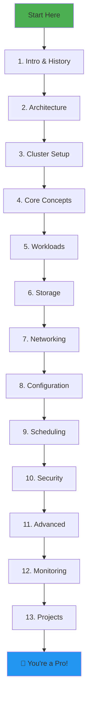

# 🚀 Kubernetes Complete Learning Guide

> **From Zero to Hero - A Complete Journey into Container Orchestration**

---

## 📚 Table of Contents

| # | Topic | File | Level |
|---|-------|------|-------|
| 1 | [Introduction & History](./01-introduction-history.md) | `01-introduction-history.md` | 🟢 Beginner |
| 2 | [Architecture Deep Dive](./02-architecture.md) | `02-architecture.md` | 🟢 Beginner |
| 3 | [Cluster Setup Guide](./03-cluster-setup.md) | `03-cluster-setup.md` | 🟢 Beginner |
| 4 | [Core Concepts](./04-core-concepts.md) | `04-core-concepts.md` | 🟡 Intermediate |
| 5 | [Workload Resources](./05-workloads.md) | `05-workloads.md` | 🟡 Intermediate |
| 6 | [Storage](./06-storage.md) | `06-storage.md` | 🟡 Intermediate |
| 7 | [Networking & Services](./07-networking-services.md) | `07-networking-services.md` | 🟡 Intermediate |
| 8 | [Configuration & Secrets](./08-configuration-secrets.md) | `08-configuration-secrets.md` | 🟡 Intermediate |
| 9 | [Scheduling & Resource Management](./09-scheduling-resources.md) | `09-scheduling-resources.md` | 🔴 Advanced |
| 10 | [Security & RBAC](./10-security-rbac.md) | `10-security-rbac.md` | 🔴 Advanced |
| 11 | [Advanced Concepts](./11-advanced-concepts.md) | `11-advanced-concepts.md` | 🔴 Advanced |
| 12 | [Monitoring & Logging](./12-monitoring-logging.md) | `12-monitoring-logging.md` | 🔴 Advanced |
| 13 | [Hands-on Projects](./13-hands-on-projects.md) | `13-hands-on-projects.md` | 🟡 Practical |
| 14 | [Cheat Sheet & Shortcuts](./14-cheatsheet.md) | `14-cheatsheet.md` | 📋 Reference |
| 15 | [Practice Workbook (20 Exercises)](./15-practice-workbook.md) | `15-practice-workbook.md` | 🏋️ Hands-on |
| 16 | [Interview Questions & Production Guide](./16-interview-production-guide.md) | `16-interview-production-guide.md` | 🎯 Interview/Prod |

---

## 🎯 Quick Memory Shortcuts

### The K8s Acronym Family
```
┌─────────────────────────────────────────────────────────────┐
│  K8s = Kubernetes (K + 8 letters + s)                       │
│  K3s = Lightweight K8s (K + 3 letters + s)                  │
│  K0s = Zero-friction K8s                                    │
└─────────────────────────────────────────────────────────────┘
```

### Remember Architecture with **"ACES"**
```
A = API Server (Brain - all communication)
C = Controller Manager (Auto-healing)
E = ETCD (Memory - stores everything)
S = Scheduler (Assigns pods to nodes)
```

### Remember Node Components with **"KKP"**
```
K = Kubelet (Agent on each node)
K = Kube-proxy (Network rules)
P = Pod (Container runtime)
```

### Workload Hierarchy: **"DRS"** (Drive!)
```
D = Deployment (manages)
R = ReplicaSet (creates)
S = Pods (runs containers)
```

---

## 🗺️ Learning Path



---

## 💡 Pro Tips Before You Start

1. **Don't memorize, understand** - Kubernetes is logical, not magical
2. **Practice daily** - Use KIND/Minikube on your local machine
3. **Break things** - Delete pods, crash nodes, see how K8s heals
4. **Read errors** - K8s error messages are surprisingly helpful
5. **Use aliases** - `alias k=kubectl` will save your fingers

---

## 🛠️ Prerequisites

Before diving in, ensure you have:
- ✅ Basic Linux/Unix commands
- ✅ Understanding of containers (Docker)
- ✅ Basic networking concepts (IP, Port, DNS)
- ✅ YAML syntax knowledge
- ✅ A laptop with 8GB+ RAM for local practice

---

**Ready to begin? Start with [01 - Introduction & History](./01-introduction-history.md)** 🚀
